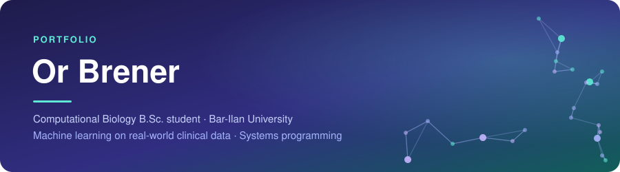

  

 

&nbsp;
&nbsp;
&nbsp;

 

I'm a computational biology student at Bar-Ilan University. My work so far has been on the computational side: predictive models built and evaluated on real patient data, and systems programming.

This repository collects the two projects I've invested the most in.

 

## Projects

<a href="./final-project-lung-cancer-survival">
<picture>
  <source media="(prefers-color-scheme: dark)" srcset="assets/card-final-project-dark.svg">
  
</picture>
</a>

A survival-analysis pipeline built on patient data from the NIH All of Us Research Program, used to test whether representing lung cancer patients as a knowledge graph and modeling them with graph neural networks predicts survival better than a regularized Cox model on the same clinical features.

**[Explore the project →](./final-project-lung-cancer-survival)**

 

<a href="./systems-programming-drive-clone">
<picture>
  <source media="(prefers-color-scheme: dark)" srcset="assets/card-drive-dark.svg">
  
</picture>
</a>

A multi-client cloud storage system: file upload, download, sharing and synchronization between a server and many concurrent clients, built in stages from the communication layer up to a web interface.

**[Explore the project →](./systems-programming-drive-clone)** · **[Source code](https://github.com/OrBrener1/Drive-part-5)**

 

## Technical toolkit

| | |
|---|---|
| **Languages** | Python, SQL, C++, Java, HTML/CSS |
| **Data & ML** | pandas, PyTorch / PyTorch Geometric, matplotlib / seaborn, exploratory data analysis, feature engineering |
| **Statistics** | Survival analysis, censored data, cross-validation, model evaluation and benchmarking |
| **Systems** | Client–server architecture, concurrency, networking, Docker, Git |

 

## Education

**B.Sc. Computational Biology**, Bar-Ilan University · 2023–present

Computational biology combines computer science with biology, chemistry and biotechnology. My project work applies the computational side to clinical and biological data.

**Core coursework** · Algorithms · Communication Networks · Machine Learning · Bioinformatics · Computational Genomics · Biochemistry · Human–Machine Interface

 

## Contact

