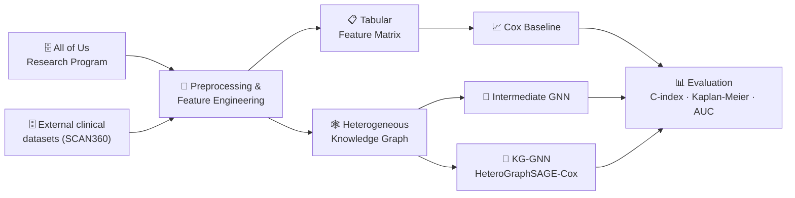

# 🧬 Machine Learning Research for Cancer Survival & Clinical Outcome Prediction

**Dr. Alon Bartal's Lab, Bar-Ilan University**
*In collaboration with the University of Miami · 2025–2026*

 

---

## Overview

> **Can we predict how a cancer patient's disease will progress — and do it better by modeling patients as a connected graph rather than as rows in a table?**

That was the question behind this project. Using real-world biomedical data from the **NIH All of Us Research Program** — a national-scale database of clinical, demographic and longitudinal patient records — we built and compared survival prediction models that range from classical statistics to modern graph deep learning.

I **co-led** the project end to end: data exploration and preprocessing, feature engineering, model development, evaluation, and presentation of findings.

 

## My contributions

- **Co-led** a machine learning research project developing predictive models for cancer survival and clinical outcomes using real-world biomedical data from the NIH All of Us Research Program.
- **Developed, evaluated and compared** statistical and graph-based machine learning models, including Graph Neural Networks (GNNs), to assess predictive performance and identify robust approaches for patient outcome prediction.
- **Worked with sensitive real-world patient health data** in a secure, privacy-compliant research environment, under strict data-access and governance requirements.
- **Collaborated** with researchers from Bar-Ilan University and the University of Miami on scientific discussions, research decisions, and presentation of project findings.

 

## Pipeline

 

## Modeling approach

Three approaches were built and benchmarked against each other, increasing in structural complexity:

| # | Model | Idea |
|:--:|---|---|
| **1** | **Tabular Cox baseline** | Classical proportional-hazards survival model over structured clinical features — the reference point every other model has to beat. |
| **2** | **Intermediate GNN** | Introduces relational structure between patients and clinical variables, letting the model learn from connections rather than isolated rows. |
| **3** | **Full KG-GNN** *(HeteroGraphSAGE-Cox)* | A heterogeneous graph neural network that unifies multiple data sources into a single knowledge graph, combined with a Cox-based survival objective. |

 

## Evaluation

Models were assessed with standard survival-analysis methodology rather than plain accuracy, since survival data is **censored** — for many patients we only know they were still alive at last follow-up, not their final outcome.

| Metric | What it tells us |
|---|---|
| **Harrell & IPCW C-index** | How well the model ranks patients by risk, with correction for censoring bias |
| **Kaplan–Meier curves** | Whether predicted risk groups actually separate in observed survival |
| **Time-dependent AUC** | Predictive performance at specific clinical horizons |
| **Stratified 5-fold CV** | That results hold up across data splits, not just one lucky partition |

 

## Stack

**Data** · NIH All of Us Research Program · SCAN360 clinical datasets
**Tools** · Python · PyTorch / PyTorch Geometric · pandas · SQL / BigQuery · lifelines / scikit-survival

 

---

### 🔒 A note on the code

The implementation lives in the lab's private research repository and is not included here. The project runs on real, identifiable patient health data inside the **All of Us Researcher Workbench**, which — under the program's data use policy — cannot be exported or shared outside its secure environment.

This write-up therefore documents the project's goals, methodology and my contributions in place of the source code. I'm happy to discuss the technical details in depth in conversation.
