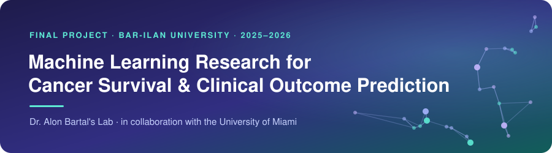
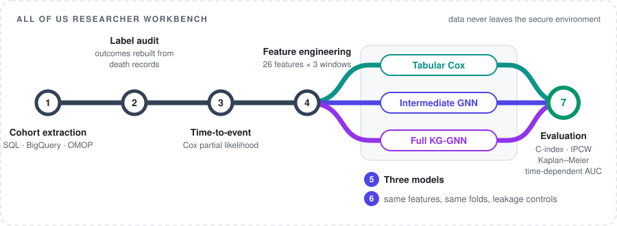

  

 

&nbsp;
&nbsp;
&nbsp;
&nbsp;

 

## Overview

The project asks whether a patient's clinical history predicts survival better when it is represented as a knowledge graph than when the same variables sit in an ordinary table. To answer that, we built a survival-analysis pipeline for lung cancer patients and ran one tabular model and two **graph neural networks** through it on identical data, features and cross-validation splits.

The data comes from the **NIH All of Us Research Program**, a US national cohort that links electronic health records, surveys and genomic data. Participant-level data never leaves the program's secure cloud workbench, so every stage described below was built and run inside it.

<picture>
  <source media="(prefers-color-scheme: dark)" srcset="assets/facts-dark.svg">
  
</picture>

 

## The pipeline

<picture>
  <source media="(prefers-color-scheme: dark)" srcset="assets/pipeline-dark.svg">
  
</picture>

 

## Step by step

### 1 · Extracting the cohort

All of Us stores its clinical records in the OMOP common data model on BigQuery. We wrote SQL queries that identified lung cancer patients through five OMOP condition concepts and their descendants, matched them against the patients already in the lab's knowledge graph, and set each patient's earliest lung cancer condition date as time zero for everything that followed.

### 2 · Auditing the outcome labels

We built the survival outcomes from verified death records: an event date for patients with a recorded death, and censoring at the last recorded clinical activity for everyone else. 

### 3 · Framing the problem as time-to-event

Most of the cohort was censored. A fixed-threshold classification ("alive after N years?") would have dropped every patient censored before the threshold, so we tested several thresholds, watched how fast the usable cohort shrank, and switched to time-to-event modeling with the Cox partial likelihood. Under that objective every patient contributes, whether or not a death was observed.

### 4 · Feature engineering

A literature review pointed to four domains that shape lung cancer survival and are recorded in All of Us: comorbidities, drug treatments, procedures and smoking history. For each domain we measured patient-level coverage in the cohort and kept feature groups that were recorded for enough patients and had clear clinical meaning in lung cancer. How often a drug or procedure appeared was never enough on its own to keep it.

That produced 26 binary features, each built for three cumulative windows: at the reference date, six months after it and twelve months after it. We settled on these windows after tracking how the features changed over time, out to 18 and 24 months, and seeing that almost all of the change happened within the first year.

### 5 · Three models, one comparison

| Model | What it sees | Our part |
|:---:|---|---|
|  **Tabular Cox** | The clinical features plus age and sex as a flat table, with ridge regularization | Built it |
|  **Intermediate GNN** | A HeteroGraphSAGE-Cox model on a reduced graph of patients, the same clinical features, age and sex | Built the reduced graph and adapted the lab's GNN from binary classification to a Cox objective |
|  **Full KG-GNN** | The same architecture on the full lung cancer subgraph, which adds genomic, geographic and social-determinants layers | The knowledge graph is an existing lab resource; we cut it down to the lung cancer cohort and added the time-dependent clinical layer |

Both GNNs share one architecture and one training configuration, so what separates them is how much of the graph they can see.

### 6 · Keeping the comparison fair

- All three models ran on the same patient-level, stratified 5-fold splits, fixed in advance, so every fold tested each model on exactly the same patients.
- Survival edges were removed from the graph encoder and each time-dependent feature was restricted to its own window, so the GNNs had no path to the outcome.
- We kept the three windows as separate views of the same cohort. Stacking them into patient-time records would have broken the independence that cross-validation relies on, since a patient's 0-month record could sit in a training fold while their 12-month record was tested, and it would have inflated the sample size without adding a single event.
- The 6- and 12-month windows include information recorded after time zero, so we added a landmark analysis that restarts the survival clock at each window and keeps only the patients still at risk at that point.

### 7 · Evaluation

With most outcomes censored, plain accuracy was not an option: for a censored patient there is no known outcome to be right or wrong about. Each model was therefore scored with Harrell's C-index and with the IPCW C-index, whose censoring weights were estimated on the training folds only. Out-of-fold predictions were then converted to within-fold risk percentiles and pooled for three further checks: Kaplan–Meier curves for predicted high- and low-risk groups, observed event rates in the highest- versus lowest-risk thirds, and time-dependent AUC at one, three and five years.

 

## Outcome

The tabular Cox model came out ahead in every time window, on both C-index measures, and the complementary analyses showed the same ranking. Neither the graph representation nor the wider knowledge-graph context improved prediction, which points to a complexity–data trade-off: with few observed deaths, the simpler regularized model generalized better. As a next step, we proposed extending the pipeline to other cancer types, to bring in more patients and observed events, and adding clinical variables with stronger prognostic value, such as tumor stage and histology.
 

## Stack

**Tools** · Python · SQL / BigQuery · pandas · PyTorch / PyTorch Geometric 
**Environment** · All of Us Researcher Workbench, Controlled Tier (data cannot be exported)

 

> [!NOTE]
> **About the code.** The implementation lives in the lab's private research repository and is not included here. The project runs on individual-level patient health data inside the All of Us Researcher Workbench, and under the program's data use policy that data cannot be exported or shared outside the secure environment. This page therefore documents the pipeline and the decisions behind each stage in place of the source code. I'm happy to go through the technical details in conversation.
