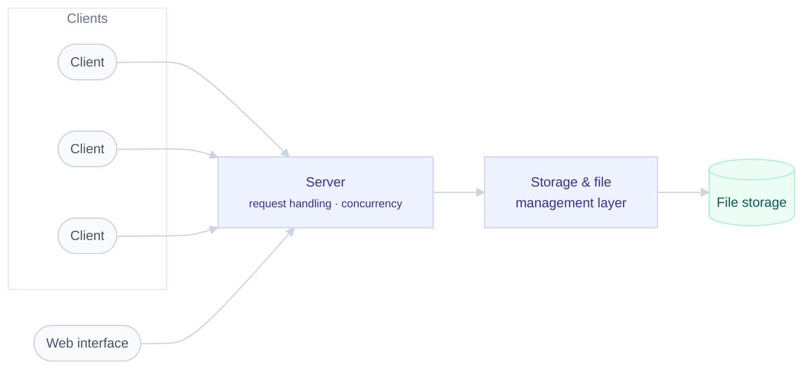

# ☁️ Cloud Storage Platform

### A Google-Drive-like system, built from scratch

*Advanced Systems Programming Project*

 

 

---

## Overview

> **What does it actually take to build the thing everyone uses without thinking about it?**

A multi-client cloud storage application supporting file upload, download, sharing and synchronization between a server and multiple concurrent clients — the core mechanics behind a service like Google Drive, implemented from the ground up.

The project was built across several development stages, each layer adding capability on top of the last: from the underlying client–server communication, through storage and file management logic, up to a web interface users actually interact with.

 

## Architecture

 

## What it does

| Capability | Description |
|---|---|
| 📤 **File operations** | Upload, download, and manage files through the platform |
| 👥 **Multi-client support** | Multiple users connected concurrently to the same server |
| 🔄 **Synchronization** | Keeping client and server state consistent |
| 🌐 **Web interface** | Browser-based UI for interacting with the storage system |

 

## Stack

**Backend & core** · C++ · Java · Python
**Interface** · HTML · CSS
**Infrastructure** · Docker

 

## Engineering focus

This project was less about the feature list and more about the systems thinking underneath it — designing a **client–server architecture** that stays correct under concurrent access, handling **network communication** between independent processes, and structuring **storage logic** that multiple clients can safely share.

 

---

**[→ Explore the full implementation](https://github.com/OrBrener1/Drive-part-5)**

